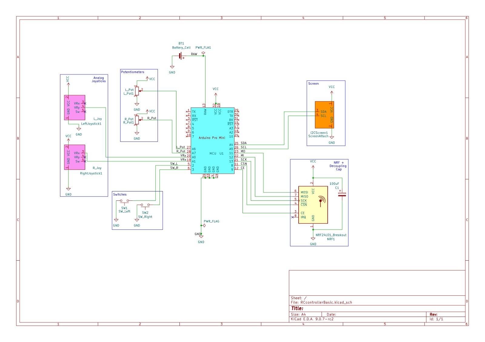

# Overview of the robot, systems, and code

Radio RC Robot Car, Tank drive system

## Wiring + Other Images

KiCad schematic exported as images.

### Controller Wiring

### Car Wiring Diagram

To be added.

## Bill of Materials

### Controller

- Arduino Pro Mini
- NRF24L01 2.4GHz Transceiver Module
- I2C 0.96 inch screen module
- Joystick Module (2)
- Potentiometers (2)
- Switches (2)
- Connecting wires
- AA battery x 3
- AA battery x 3 holder

### Car

Car can be assembled with anything as long as there is a microcontroller, a good h-bridge motor driver (with HIGH-LOW-PWM code), motors in tank drive, an NRF module same as the one used in the controller, and a power source. If using lithium please be careful. An optional BOM is given below.

- ESP32 microcontroller
- NRF24L01 2.4GHz Transceiver Module
- TB6612FNG Dual Motor Driver Module
- AA battery x 4
- AA battery x 4 holder
- 6V N20 motors
- Connecting wires

## Instructions for use

### Libraries used
#### Controller
- <SPI.h>
- <Wire.h>
- <RF24.h>
- <nRF24L01.h>
- <Adafruit_GFX.h>
- <Adafruit_SSD1306.h>

#### Car
- <SPI.h>
- <RF24.h>
- <nRF24L01.h>

### Some details about the code

